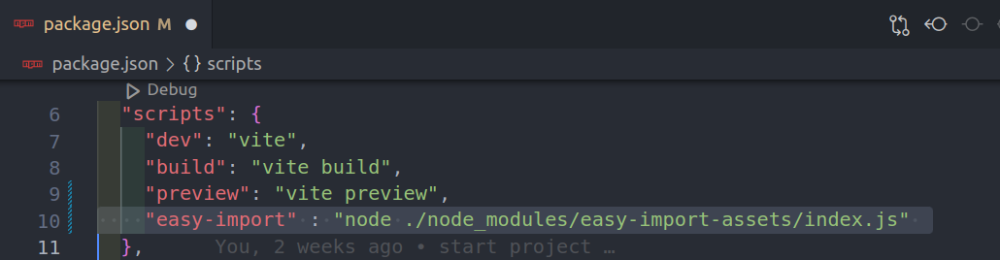
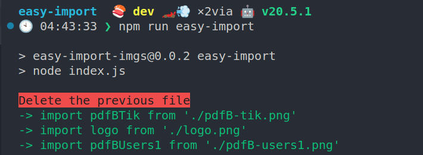

# Easy Import

To easily and quickly import files into the React project

-> Import all the photos in the project by just doing 3 steps

## Description

**Step 1 :** Install Package 
```javascript
  npm run test
```

**Step 2 :** Add the command to run to the **Package.json** file
```javascript
"easy-import" : "node ./node_modules/easy-import-assets/index.js"
```



**Step 3 :** Enter the following command in the terminal and all the files in the **src/assets/imgs** folder will be imported easily

```javascript
‍‍‍npm run easy-import
```



A file called index.js is created in the  **src/assets/imgs**, which imports all the files in the folder

You can access all the files in the folder by importing object imgs from the **src/assets/imgsindex.js** file
